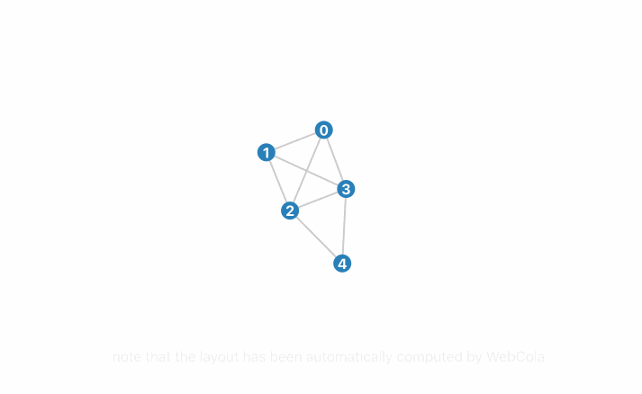

<p align="center">
  <a href="http://mauriciopoppe.github.io/greuler/">
    
    
  </a>
</p>

<p align="center">
  <a href="https://npmjs.org/package/greuler">
    
  </a>
  <a href="https://github.com/mauriciopoppe/greuler/workflows/CI">
    
  </a>
  <a href="https://github.com/feross/standard">
    
  </a>
</p>

---

<b>greuler</b> is graph theory visualization tool powered by <a href="http://d3js.org/">d3</a>
and on top of <a href="http://marvl.infotech.monash.edu/webcola/">WebCola</a>
which allows the creation and manipulation of graphs with a simple API.

## Installation

```sh
npm install greuler
```

or

```html
<script src="https://unpkg.com/greuler"></script>
```

## Usage

```js
import greuler from 'greuler'
greuler({
  nodes: [
    { id: 0 },
    { id: 1 },
    { id: 2 },
    { id: 3 },
    { id: 4 },
    { id: 5 }
  ],
  edges: [
    { source: 0, target: 1 },
    { source: 0, target: 2, directed: true },
    { source: 0, target: 3 },
    { source: 1, target: 2, directed: true },
    { source: 4, target: 0 },
    { source: 5, target: 0, directed: true },
    { source: 4, target: 5 }
  ]
}).update()
```

## API and Examples

Check out the examples and API at the [`homepage`](http://mauriciopoppe.github.io/greuler/)

## License

2023 MIT © Mauricio Poppe

[npm-image]: https://img.shields.io/npm/v/greuler.svg?style=flat
[npm-url]: https://npmjs.org/package/greuler
